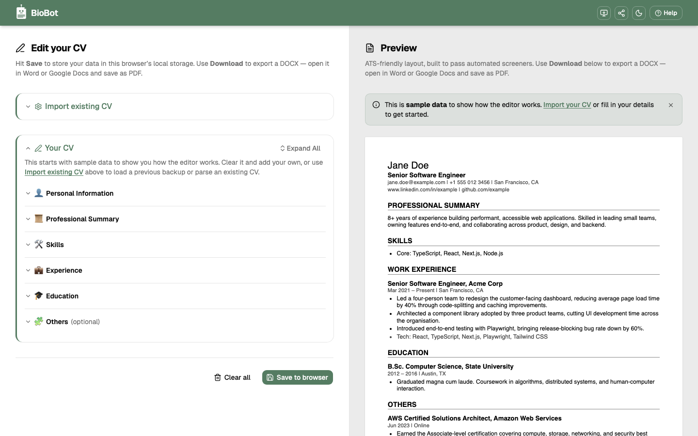
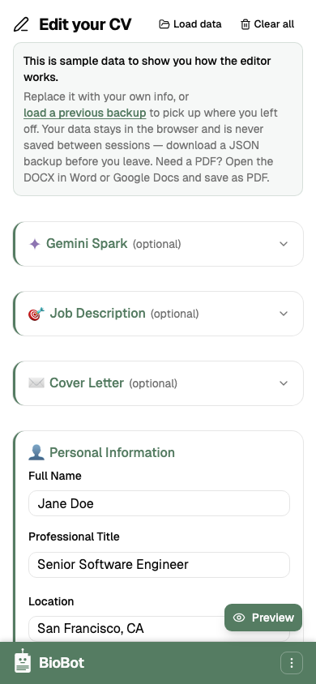
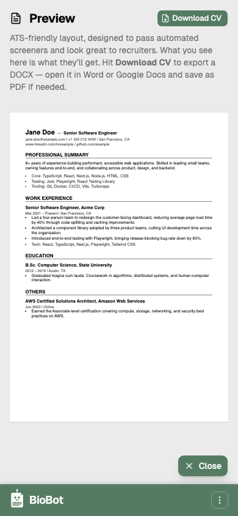

# 🤖 BioBot &nbsp;<a href="https://batbrain9392.github.io/cv-builder/"></a>

AI-powered CV and cover letter builder that runs entirely in your browser.

✍️ Writing a CV is hard. 🎯 Tailoring it for every job you apply to is even harder. This app lets you load your full career history once, paste a job description, let AI reshape your experience highlights and summary to match, then tweak the result before you export. 📋 The Word (DOCX) output uses clean, structured formatting designed to be parsed correctly by most applicant tracking systems (ATS).

[](https://github.com/batbrain9392/cv-builder/actions/workflows/ci.yml)

 &nbsp;  &nbsp; 

📲 Installable as a [Progressive Web App](https://web.dev/explore/progressive-web-apps) — works offline on phone or desktop, no app store needed. Core editing and export work without a connection; AI features require internet.

## ✨ Features

- ✏️ Build and edit a CV with a **live side-by-side preview**
- 🤖 **AI-powered generation** of professional summary, cover letter, and experience highlights using Google Gemini
- 📄 Export to **DOCX** or **JSON** — import from JSON to pick up where you left off
- 📝 **Markdown** support in text fields for rich formatting
- 📲 Installable **Progressive Web App** with service worker caching

## 🧑‍💻 Using the AI features (optional)

The core CV builder works perfectly without AI — you can build, preview, and export without ever enabling it. AI tailoring is an **opt-in** feature that uses Google Gemini to rewrite your content to match a specific job description. You bring your own API key (free tier, no billing required).

1. 👤 Fill in all your details — personal info, experience, education, skills — or **import a JSON** you exported earlier
2. 📋 Paste a **job description** into the Job Description section and add your free [Gemini API key](https://aistudio.google.com/apikey)
3. 🤖 Hit **Enhance with AI** to tailor your experience highlights, summary, and cover letter to the job, then tweak anything that still feels off
4. 💾 Hit **Save** to store your progress in the browser, or export as DOCX for submission / JSON for a portable backup
5. 📄 Need a PDF? Open the DOCX in Word, Google Docs, or LibreOffice and print to PDF

## 🔒 Privacy

- 🍪 **No cookies.** None.
- 🚫 **No backend server.** Gemini API calls go directly from your browser to Google using your own API key.
- 💾 **`localStorage`** is used to save your CV data, Gemini API key, and theme preference in your browser so you can pick up where you left off. Nothing is sent to any server.
- 🔑 Your Gemini API key is stored locally on your device — never on a server. Anyone with access to this browser can read it, so use a device you trust.
- 📤 You can also export your data as JSON or DOCX at any time. Use **Clear all** in the editor to wipe both the form and local storage.

## ⚙️ Tech stack

|     | Technology                                                                   |                           |
| --- | ---------------------------------------------------------------------------- | ------------------------- |
| ⚛️  | [React 19](https://react.dev) + TypeScript                                   | UI framework              |
| ⚡  | [Vite 6](https://vite.dev)                                                   | Build tool                |
| 🎨  | [Tailwind CSS v4](https://tailwindcss.com) + [shadcn](https://ui.shadcn.com) | Styling and components    |
| 📋  | [react-hook-form](https://react-hook-form.com) + [Zod](https://zod.dev)      | Form state and validation |
| 🔀  | [react-router](https://reactrouter.com)                                      | Client-side routing       |
| 📄  | [docx.js](https://docx.js.org)                                               | Word document generation  |
| 📝  | [marked](https://marked.js.org)                                              | Markdown rendering        |
| 🌐  | Fully client-side                                                            | No backend required       |

## 🛠️ Built with

🖥️ Code written in **[Cursor](https://cursor.com)** with **[Claude Opus](https://anthropic.com/claude)** by Anthropic. ✨ Live AI features inside the app are powered by **[Google Gemini](https://gemini.google.com)** (gemini-2.5-flash).

## 🚀 Deployment

Deployed automatically to **GitHub Pages** on every push to `main` via [GitHub Actions](.github/workflows/ci.yml). CI runs lint, typecheck, tests, and build — deploy only happens if all checks pass. The app is served under a `/cv-builder/` subpath and uses `HashRouter` for client-side routing, so in-app URLs look like `/#/app`.

To enable on a fresh fork: go to **Settings > Pages** and set the source to **GitHub Actions**.

## 💻 Local development

Requires **Node 20+**.

```bash
npm ci
npm run dev
```

| Script                      | Purpose                                                              |
| --------------------------- | -------------------------------------------------------------------- |
| `npm run dev`               | Start local dev server                                               |
| `npm run build`             | Type-check and production build                                      |
| `npm run preview`           | Preview the production build                                         |
| `npm run lint`              | Run ESLint                                                           |
| `npm run typecheck`         | Run TypeScript compiler checks                                       |
| `npm run test`              | Run tests with Vitest                                                |
| `npm run test:e2e`          | Run Playwright end-to-end tests                                      |
| `npm run generate:icons`    | Regenerate PWA icons and favicon                                     |
| `npm run generate:og`       | Regenerate OG image and screenshots (requires `npm run build` first) |
| `npm run generate:overview` | Regenerate `OVERVIEW.md` (project map for AI agents)                 |

📖 See [`OVERVIEW.md`](OVERVIEW.md) for a detailed project map, architecture notes, and file inventory — useful for contributors and AI agents.

## 💬 Feedback

Found a bug or have a feature idea? [Open an issue](https://github.com/batbrain9392/cv-builder/issues) or send a message on [LinkedIn](https://www.linkedin.com/in/batbrain9392/).

🫣 **Design tips:** Design feedback especially welcome — suggestions, mockups, or gentle roasts with actionable fixes are all appreciated.
